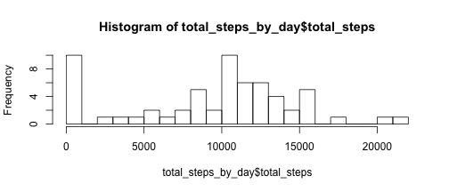
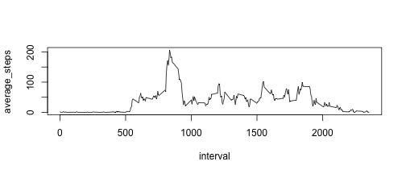
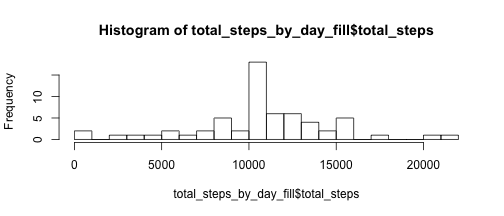
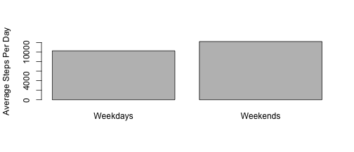

## Loading and preprocessing the data

```r
activity <- read.csv(unz("activity.zip", "activity.csv"))
summary(activity)
```

```
##      steps                date          interval     
##  Min.   :  0.00   2012-10-01:  288   Min.   :   0.0  
##  1st Qu.:  0.00   2012-10-02:  288   1st Qu.: 588.8  
##  Median :  0.00   2012-10-03:  288   Median :1177.5  
##  Mean   : 37.38   2012-10-04:  288   Mean   :1177.5  
##  3rd Qu.: 12.00   2012-10-05:  288   3rd Qu.:1766.2  
##  Max.   :806.00   2012-10-06:  288   Max.   :2355.0  
##  NA's   :2304     (Other)   :15840
```

## What is mean total number of steps taken per day?

```r
total_steps_by_day <- aggregate(activity$steps, by=list(activity$date), FUN=sum, na.rm=TRUE)
colnames(total_steps_by_day) <- c("date", "total_steps")
hist(total_steps_by_day$total_steps, breaks=20)
```

 


```r
mean_steps_per_day <- mean(total_steps_by_day$total_steps)
```
Average steps per day is 9354.2295082


```r
median_steps_per_day <- median(total_steps_by_day$total_steps)
```
Median steps per day is 10395

## What is the average daily activity pattern?

```r
average_steps_by_interval <- aggregate(activity$steps, by=list(activity$interval), FUN=mean, na.rm=TRUE)
colnames(average_steps_by_interval) <- c("interval", "average_steps")
plot(average_steps_by_interval, type="l")
```

 

### Which interval, on average contains the maximum number of steps?

```r
average_steps_by_interval[which.max(average_steps_by_interval$average_steps),]
```

```
##     interval average_steps
## 104      835      206.1698
```


## Imputing missing values
Missing values filled in using mean steps for missing interval across all dates

```r
filled <- merge(activity, average_steps_by_interval, by = "interval")
filled[is.na(filled$steps), "steps"] <- filled[is.na(filled$steps), "average_steps"]
summary(filled)
```

```
##     interval          steps                date       average_steps    
##  Min.   :   0.0   Min.   :  0.00   2012-10-01:  288   Min.   :  0.000  
##  1st Qu.: 588.8   1st Qu.:  0.00   2012-10-02:  288   1st Qu.:  2.486  
##  Median :1177.5   Median :  0.00   2012-10-03:  288   Median : 34.113  
##  Mean   :1177.5   Mean   : 37.38   2012-10-04:  288   Mean   : 37.383  
##  3rd Qu.:1766.2   3rd Qu.: 27.00   2012-10-05:  288   3rd Qu.: 52.835  
##  Max.   :2355.0   Max.   :806.00   2012-10-06:  288   Max.   :206.170  
##                                    (Other)   :15840
```
Histogram after filling in missing date.

```r
total_steps_by_day_fill <- aggregate(filled$steps, by=list(filled$date), FUN=sum, na.rm=TRUE)
colnames(total_steps_by_day_fill) <- c("date", "total_steps")
hist(total_steps_by_day_fill$total_steps, breaks=20)
```

 


```r
mean_steps_per_day_fill <- mean(total_steps_by_day_fill$total_steps)
```
Average steps per day after filling is 1.0766189 &times; 10<sup>4</sup>


```r
median_steps_per_day_fill <- median(total_steps_by_day_fill$total_steps)
```
Median steps per day after filling is 1.0766189 &times; 10<sup>4</sup>

## Are there differences in activity patterns between weekdays and weekends?

```r
total_steps_by_day_fill$dayofweek <- weekdays(as.Date(total_steps_by_day_fill$date))

total_steps_by_day_fill$weekend <- total_steps_by_day_fill$dayofweek %in% c("Saturday","Sunday")

average_daily_steps_by_weekend <- aggregate(total_steps_by_day_fill$total_steps, by=list(total_steps_by_day_fill$weekend), FUN=mean, na.rm=TRUE)

colnames(average_daily_steps_by_weekend) <- c("weekend", "average_steps")

barplot(average_daily_steps_by_weekend$average_steps, names.arg=c("Weekdays", "Weekends"), ylab="Average Steps Per Day", horiz=FALSE)
```

 
